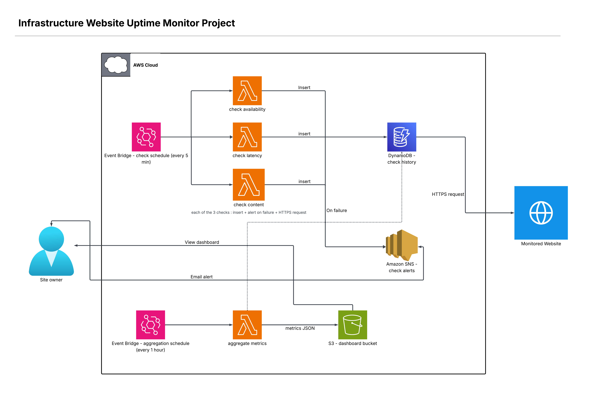

# Website Uptime Monitor

Website Uptime monitor is a serverless monitoring system for a website build with AWS and Terraform only. It is part of my personal project on AWS during my 5th year degree as computer science student to learn more about AWS architecture and Iac notions.

## Problem

One of the most fear for a website owner it's that it break down with anyone being aware of at time which considerally impact global cost and reputation of regularly customer and the potenital new. This project realize several check for the target website at regular intervals. Then it records each result and aler the owner within second as soon as a problem has been detected.

## What it does

Three independent checks run periodically on the monitored website. The availability check verify if the site respond or if there is a network or server problem. The latency check verify how fast the site load since visitors tend to leave when it take too long. The content check verify if the page show the expected content without any error message. If one of the check fail an SNS notification is sent immediately by email with the reason of the failure. Each result is stored in DynamoDB with the timestamp and the response time and the success or failure status and the error message if any so it build an history over time. A fourth Lambda called aggregate_metrics runs in addition to the three main checks. It reads the history from DynamoDB and push a JSON file to the S3 bucket to feed a static dashboard with key metrics I chose myself, like the availability percentage and the average response time and the failures per check type. The dashboard also got a frontend part to make the global view nicer and easier to read.

## Architecture

The diagram below represent the whole system from the check scheduling to the three Lambda functions the history storage the alert system and the dashboard feed.

## Stack

The project use AWS services like Lambda DynamoDB SNS S3 and EventBridge to run everything without any server to manage. Terraform handle the infrastructure as code and keep a remote state on S3 with a lock table on DynamoDB. The Lambda functions are written in Python. Everything is versioned on GitHub and the architecture diagram was made with LucidChart.

## Testing

The three checks were manually tested by breaking the monitored website on purpose and checking that both the alerts and the history worked as expected, see [testing-3-lambdas.md](docs/testing/testing-3-lambdas.md). The aggregate_metrics Lambda was tested the same way, see [testing-aggregate-metrics.md](docs/testing/testing-aggregate-metrics.md). Both include screenshots of the result. The least-privilege IAM policy was tested by actually detaching AdministratorAccess and fixing every AccessDenied error that came up, see [testing-iam-least-privilege.md](docs/testing/testing-iam-least-privilege.md).

## Status

The project is build incrementally one validated piece at a time. Check the commit history to see the detail of the progress. The system is now fully operational as a v1: the three checks and the alerting and the history and the dashboard are all working end to end. IAM least-privilege hardening is done, the deployer user now runs on a scoped policy instead of AdministratorAccess. A more complete monitored website and automated tests with pytest and moto are planned as the next steps.

## Known limitations

If the website is fully down all three checks fail at the same time and each one send its own SNS notification, so up to 3 separate emails can be sent for a single incident. The three Lambdas are independent and don't know about each other yet. Deduplicating these alerts into a single incident notification is planned as a future improvement.

## Author

Maxime Hochereau final year computer science engineering student. Career goal is cloud architect then cloud cybersecurity.
