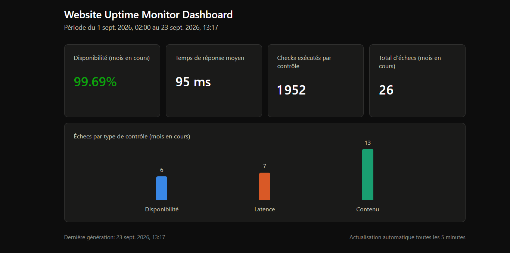

# Website Uptime Monitor

Website Uptime monitor is a serverless monitoring system for a website build with AWS and Terraform only. It is part of my personal project on AWS during my 5th year degree as computer science student to learn more about AWS architecture and Iac notions.

## Problem

One of the most fear for a website owner it's that it break down with anyone being aware of at time which considerally impact global cost and reputation of regularly customer and the potenital new. This project realize several check for the target website at regular intervals. Then it records each result and aler the owner within second as soon as a problem has been detected.

## What it does

Three independent checks run periodically on the monitored website. The availability check verify if the site respond or if there is a network or server problem. The latency check verify how fast the site load since visitors tend to leave when it take too long. The content check verify if the page show the expected content without any error message. If one of the check fail an SNS notification is sent immediately by email with the reason of the failure. Each result is stored in DynamoDB with the timestamp and the response time and the success or failure status and the error message if any so it build an history over time. A fourth Lambda called aggregate_metrics runs in addition to the three main checks. It reads the history from DynamoDB and push a JSON file to the S3 bucket to feed a static dashboard with key metrics I chose myself, like the availability percentage and the average response time and the failures per check type. The dashboard also got a frontend part to make the global view nicer and easier to read.

## Architecture

The diagram below represent the whole system from the check scheduling to the three Lambda functions the history storage the alert system and the dashboard feed.

## Results

This is the dashboard on 23 September 2026. The failures come from my manual tests, where I broke the site on purpose.

When a check fails, an email is sent with the reason, here a 404 on the availability check.

Every check is saved in DynamoDB, so the history stays available.

## Stack

The project use AWS services like Lambda DynamoDB SNS S3 and EventBridge to run everything without any server to manage. Terraform handle the infrastructure as code and keep a remote state on S3 with a lock table on DynamoDB. The Lambda functions are written in Python. Everything is versioned on GitHub and the architecture diagram was made with LucidChart.

## Testing

The three checks were manually tested by breaking the monitored website on purpose and checking that both the alerts and the history worked as expected, see [testing-3-lambdas.md](docs/testing/manual/testing-3-lambdas.md). The aggregate_metrics Lambda was tested the same way, see [testing-aggregate-metrics.md](docs/testing/manual/testing-aggregate-metrics.md). Both include screenshots of the result. The least-privilege IAM policy was tested by actually detaching AdministratorAccess and fixing every AccessDenied error that came up, see [testing-iam-least-privilege.md](docs/testing/manual/testing-iam-least-privilege.md).

On top of that, the 4 Lambdas have 12 automated tests with pytest and moto, 3 tests per Lambda, see [testing-automated-tests.md](docs/testing/automated/testing-automated-tests.md). This part is very important: the manual tests take several minutes and nobody replays them after each change, but the automated ones replay the same situations in about 10 seconds. If a change breaks a Lambda, a test goes red right away. They run on a fake AWS, so nothing real is touched and nothing is paid. The tests are written with pytest, and a GitHub Actions workflow runs them automatically on every push and pull request, see [ci-check.md](docs/testing/automated/ci-check.md). The tests are in the [automated-tests](automated-tests) folder, one file per Lambda: [check_availability](automated-tests/test_check_availability.py), [check_latency](automated-tests/test_check_latency.py), [check_content](automated-tests/test_check_content.py) and [aggregate_metrics](automated-tests/test_aggregate_metrics.py). The doc explains each test, and also shows a test going red after I broke the code on purpose.

## Status

The project is finished. It was built incrementally, one validated piece at a time, check the commit history to see the detail of the progress. The system is fully operational as a v1: the three checks, the alerting, the history and the dashboard all work end to end. IAM least-privilege hardening is done, and the deployer user now runs on a scoped policy instead of AdministratorAccess. The monitored website is done too. It has real content on 4 pages, not just one empty page, you can visit it [here](http://website-uptime-monitor-site.s3-website-eu-west-1.amazonaws.com). The automated tests with pytest and moto are done as well, they cover the logic of the 4 Lambdas.

A better version of the project is coming. The points that could be improved are listed in the limitations below.

## Known limitations

If the website is fully down all three checks fail at the same time and each one send its own SNS notification, so up to 3 separate emails can be sent for a single incident. The three Lambdas are independent and don't know about each other yet. Deduplicating these alerts into a single incident notification is planned as a future improvement.

The dashboard uses plain HTTP, not HTTPS because there is no CloudFront in front of the S3 bucket yet. The Terraform deployer user is also the IAM user for the AWS console login. So a manual change through the console is still possible, on top of what Terraform manages. Separating these two identities might be consider as a improvement for later.

The deployer user can also change its own permissions. Terraform needs this to manage the deployer policy and the IAM roles of the Lambdas so it can't just be removed which is make things harder than I thought. It means that if the access keys leaked, an attacker could give AdministratorAccess back to the user. A permissions boundary would fix this. It is not done here because it adds a lot of complexity for this project.

The automated tests don't cover everything. The pagination in aggregate_metrics (the loop that reads DynamoDB again when the answer is bigger than 1 MB) is not tested. I looked at it, but unfortunately to test it I need to force DynamoDB to split its answers and it was too complex for this project so far. The real AWS side (IAM rights, EventBridge, real emails) is only checked by the manual tests.

## Author

Maxime Hochereau final year computer science engineering student. Career goal is cloud engineer, cloud architect then cloud cybersecurity.
