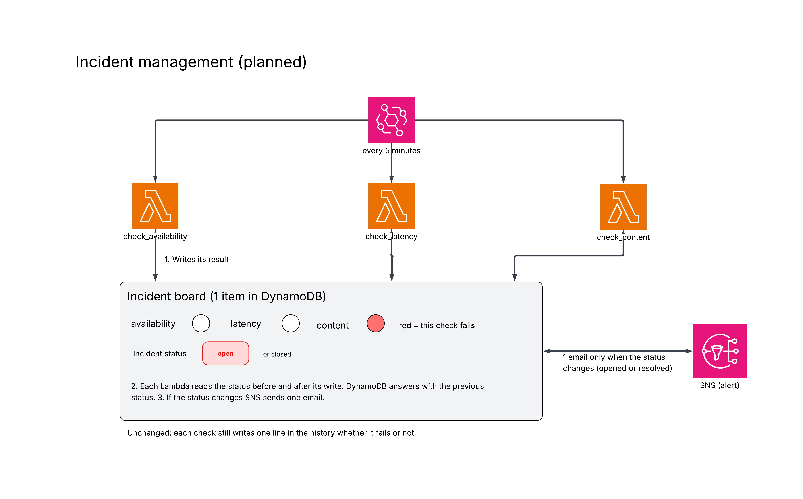

# Incident management (planned)

This part is not done yet. This document explains what I want to build and why, before the coding part.

## The problem

Right now each check sends its own email as soon as it fails. If the site goes down, the three checks fail at the same time, so we receive up to 3 emails every 5 minutes for only one outage. The alerts become juste like noise and nothing says when the problem is solved.

## The idea

An incident is one outage seen as a whole. The goal is to get only one email when it opens and only one when it is resolved and nothing between the two.

For that the three Lambdas share one item in DynamoDB which is the incident board. Each Lambda writes the result of its own check there with a switch and the switch is on when the check fails. The board also says if an incident is open or closed. The Lambdas don't talk to each other but they all read and write the same board so each one can adapt to what the others did.

## The rules

| Situation | What happens |
| --- | --- |
| A check fails, no incident is open | The incident opens, one email is sent |
| A check fails, an incident is already open | Nothing |
| A check succeeds, some switches are still on | Nothing, the incident stays open |
| The three checks succeed, an incident is open | The incident closes, one email is sent |

The incident opens at the first failure without waiting for a confirmation. The site is not a real site so a real problem will last and trigger the alert anyway. The downside is that a small one-time glitch would send two emails which are opened and then resolved. I accept that.

The closing is strict. When the page content is broken the site still answers which means the availability check succeeds while the content check fails. If availability could close the incident we would receive a false "resolved" email and this is dangerous because it creates a false feeling of safety while the problem is still there. It would also confuse the owner who looks at the history to understand what happened. Therefore the incident closes only when the three checks are back to normal.

When the three checks fail in the same second DynamoDB handles the writes one by one and tells each Lambda what the status was before. Only the first one hears "closed" so only that one sends the opening email.

## What the emails say

The opening email gives the check that detected the incident and its error message. If the message says the site is unreachable the email adds that the other checks are probably affected too because the whole site is down. The resolved email lists all the checks affected during the incident with their last message.

## What changes

The three check Lambdas use a shared file called `incident.py` instead of their current alert code. One more IAM action is needed which is `dynamodb:UpdateItem` and the tests are updated. Nothing changes for `aggregate_metrics`, the dashboard, the history and EventBridge.

## Known limit

If the code of a Lambda crashes it writes nothing on the board and sends nothing. A CloudWatch alarm on the Lambda errors is planned separately.

## Schema

