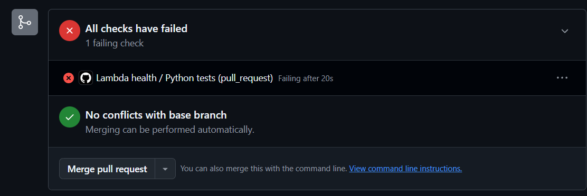
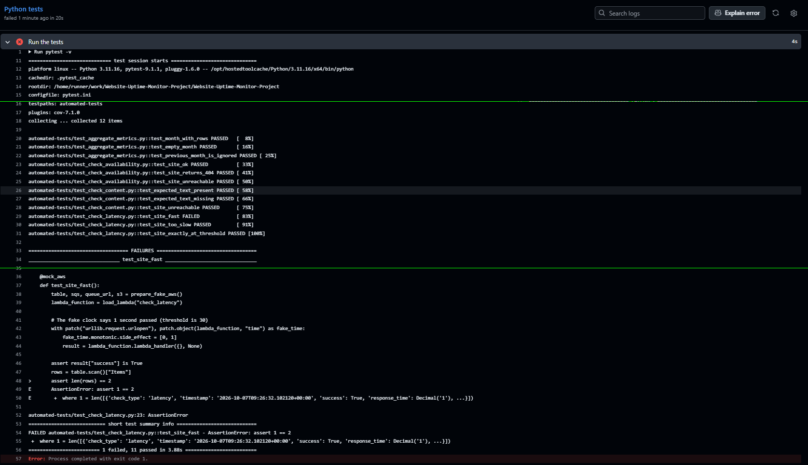

# CI check: does the job catch an error?

After adding the GitHub Actions workflow that runs the automated tests, we need to check that the job really detects an error when something is wrong in the code.

## What we did

On a separate branch (`test-ci-red`), we changed one assert in `automated-tests/test_check_latency.py`. Line 23 went from `assert len(rows) == 1` to `assert len(rows) == 2`. Then we opened a pull request to `main`.

## Result

The job started by itself and failed: 11 tests passed and 1 failed. The red sign is visible in the pull request.

The logs show which test failed and why (`assert 1 == 2`).

## Conclusion

The CI can fail, so a green check now means something. The pull request was closed without merging, so `main` stays clean.
