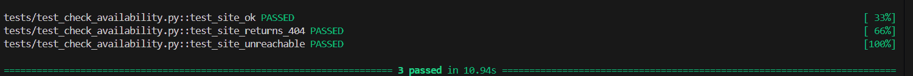
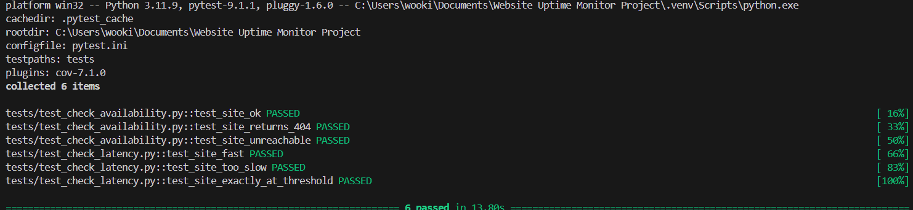
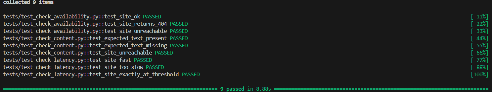
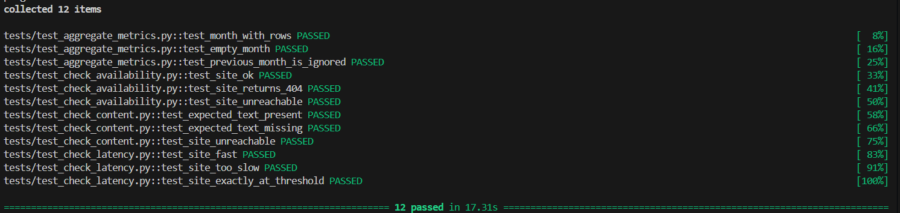
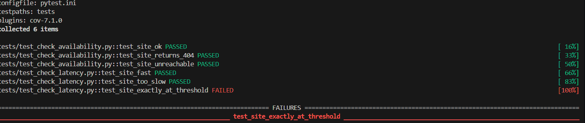

# Automated tests with pytest and moto - Website Uptime Monitor

## Why automated tests
 
Before this step, every Lambda was tested by hand on the real AWS (see the other files in docs/testing/): which could be summed up to break the site, wait for the alert, look at DynamoDB. Every step for tests works but it is slow and nobody replays it after each change. It’s with this kind of context the automated tests exist. They are going to replay the same situations in about 10 seconds, with no AWS, no cost, no waiting which is more powerful than just testing by hand.
 
## Tools and what each one does
 
using pytest is essential. It globally runs the tests (finds the test_ files and functions, shows PASSED or FAILED).

moto is a fake AWS in memory (DynamoDB, SNS, SQS, S3 any resources needed for the project has been faked by moto itself ). so the Lambda code runs unchanged.

boto3 is the library that the Lambdas already use to talk to AWS, moto answers instead of AWS. unittest.mock (standard Python) replaces urlopen to simulate a site (200, 404, no network) and replaces the Lambda clock to simulate a slow site (check_latency).

pytest-cov is planned to show the coverage. (Versions are pinned in requirements-dev.txt that is outside the Lambda zips.)

## How a test works

Every test has the same 3 steps. First we build the fake AWS (the table, the topic, the bucket). Then we simulate a situation, for example a site that answers 404. At the end we look at what the Lambda did: the row saved in the table and the alert received.

The setup is the same for all the tests, so it lives in one file: [automated-tests/fake_aws.py](../../../automated-tests/fake_aws.py). One small thing: SNS doesn't keep the messages it sends only. So a fake queue (SQS, AWS service) is plugged on the fake topic, and the test reads the alerts in this queue.

The Lambdas are not changed. We test the code exactly as it is deployed.

To run everything, from the root of the repo which is going to activate pytest in the virtual environment:

```
.venv\Scripts\python.exe -m pytest -v
```

## Tests of check_availability

A site can do 3 things: work, answer with an error, or not answer at all. One test for each. The tests are in [automated-tests/test_check_availability.py](../../../automated-tests/test_check_availability.py).

### test_site_ok

The site answers 200. We check that one row is saved as a success and that no alert is sent. It's the normal case, it shows that the Lambda doesn't panic for nothing.

### test_site_returns_404

The site answers 404. With a real 404, `urlopen` raises an error, so the fake one does the same. We check that a failure is saved with 404 in the message, and that one alert is sent with the same reason.

### test_site_unreachable

No network at all. The row is saved as a failure with "Request failed" in the message, and one alert is sent.



## Tests of check_latency

A site can answer and still be too slow. To test this without waiting 30 seconds for real, the clock of the Lambda is replaced by a fake one that says how many seconds passed. The tests are in [automated-tests/test_check_latency.py](../../../automated-tests/test_check_latency.py).

### test_site_fast

The fake clock says 1 second, the threshold is 30. The check is a success, one row is saved, no alert.

### test_site_too_slow

The fake clock says 40 seconds. The check fails with "exceeds threshold" in the message, a row is saved and one alert is sent.

### test_site_exactly_at_threshold

Exactly 30 seconds. The code uses `>` and not `>=`, so it's still a success and no alert is sent. It's the most precise test of the file, and we use it for the break on purpose below.



## Tests of check_content

Here the site answers, only the content of the page changes. The tests are in [automated-tests/test_check_content.py](../../../automated-tests/test_check_content.py).

### test_expected_text_present

The page contains the expected text ("Website Uptime Monitor"). The check is a success, one row is saved, no alert.

### test_expected_text_missing

The site answers, but the page doesn't contain the text (an error page for example). The availability check would say OK here, so only this one can see the problem. A failure is saved with "not found on page" and one alert is sent.

### test_site_unreachable

The site is down, so the page can't be read at all. The row is a failure with "Request failed" and one alert is sent.



## Tests of aggregate_metrics

This Lambda doesn't check the site. It reads the history in DynamoDB and writes the metrics.json file for the dashboard. So the tests put known rows in the fake table, freeze the date to 2 October 2026, then read metrics.json in the fake bucket. The tests are in [automated-tests/test_aggregate_metrics.py](../../../automated-tests/test_aggregate_metrics.py).

### test_month_with_rows

4 availability checks with 1 failure, 2 latency checks (1 second and 3 seconds) and 2 content checks. We check the availability (75 percent), the average response time (2 seconds) and the counters of each check. The numbers are simple on purpose, so we can do the calculation in our head.

### test_empty_month

No rows at all. The Lambda must not divide by zero, so availability and average response time are both 0. It really happens on the 1st of the month, before the first check.

### test_previous_month_is_ignored

A failure from September and a success from October. Only October must be counted, so we expect 1 check and 100 percent. This test checks the date window of the query.

All 12 tests of the 4 Lambdas run together and pass.



## Breaking the code on purpose

A green test only says something if it can also go red. So we changed one character in check_latency: `>` became `>=` in the line that compares the response time with the threshold. Only test_site_exactly_at_threshold turned red, the 5 other tests stayed green.



Then the code was put back and everything was green again. It's a tiny change that nobody sees when reading the code, but a test aimed at the exact limit catches it.

## Findings

While preparing the tests we saw that `urlopen` raises an error by itself on a 404 or a 500. So the line `if status >= 400` in check_availability is never reached. The behavior is still correct, because the error is caught by the `except` block and gives "Request failed: HTTP Error 404: Not Found". We didn't change the code, and the test checks the real behavior.

## What is not tested

The pagination in aggregate_metrics, which is the loop that follows `LastEvaluatedKey`. DynamoDB cuts a response at 1 MB and the project is far from that. We looked at how to test it, but we need to force DynamoDB to split its answers, and that was too complex for this project.

The real AWS side (IAM rights, EventBridge schedule, real emails) is covered by the manual tests only. The automated tests don't replace them, they come after.
