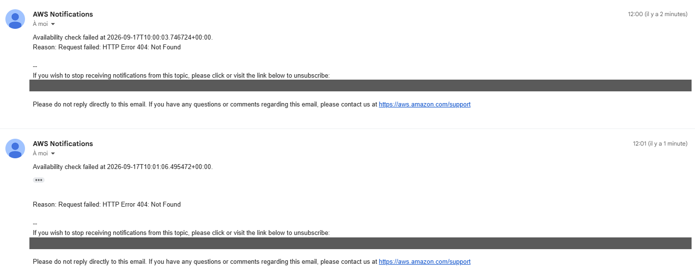
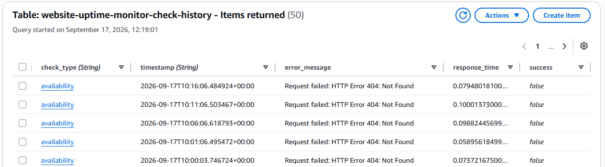
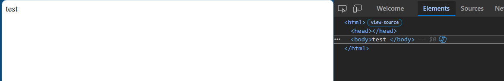
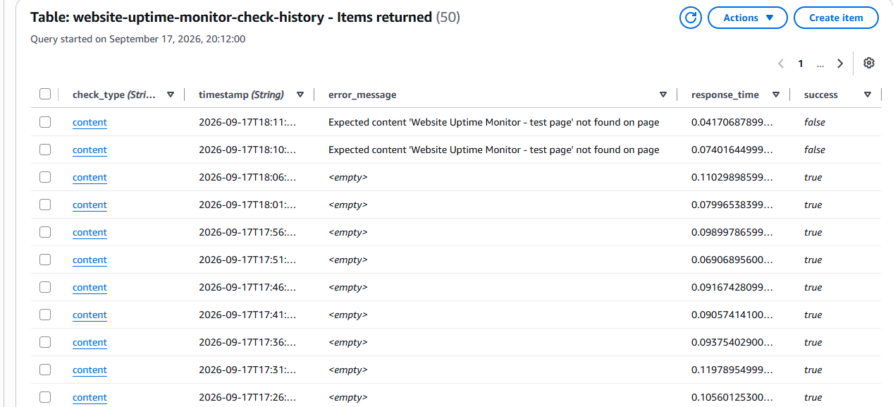

# Testing the Lambdas - Website Uptime Monitor

The goal here is to test the three Lambdas independently (availability, latency, content), to check that they work correctly before considering the system operational.

## Test 1: check_availability

The test is simple: we delete the `index.html` file hosted on the S3 bucket, to check that an error notification arrives correctly on the SNS topic via mailbox.

When invoking the Lambda manually, the notification arrives almost immediately.



Note: deleting the html file actually triggers all 3 alerts (availability, latency and content), which explains the multiple notifications received. The system doesn't tell the difference between a real site outage and an isolated test of a single Lambda, since each check is independent. Centralizing the alerts is an improvement planned for later.

We then check in DynamoDB that the failure is correctly recorded (`success = false`):



To put the site back to its initial state, a simple `terraform apply` is enough: Terraform recreates the `index.html` object with the content defined in the config. This file doesn't have S3 versioning enabled, so there is no risk in deleting it, unlike other more critical resources of the project.

## Test 2: check_latency

This test checks that going over the latency threshold correctly triggers an alert.

By running:

```
terraform apply -var="latency_threshold_seconds=0.001"
```

we temporarily lower the default threshold (30 seconds) to 0.001 second. When invoking the `check_latency` Lambda, the actual response time necessarily goes over this threshold and triggers the alert:


We check in DynamoDB (Query mode, sorted in descending order to see the most recent entries first):


To go back to the normal config, a `terraform apply` without the `-var` option is enough: Terraform reapplies the default value defined in `variables.tf`.

## Test 3: check_content

This test is different: it's about the content displayed by the site, not its availability or speed. The idea: we upload a replacement `index.html` file, with the same name as the original, which overwrites the existing file on the S3 bucket.


The site then shows content that's different from what's expected:



When invoking the `check_content` Lambda, we get an error notification confirming that the expected content is no longer on the page:


Check in DynamoDB: the failure is correctly recorded (`success = false`), with the matching error message:



To restore the correct content, a regular `terraform apply` isn't enough here. The `aws_s3_object` resource doesn't automatically detect changes made outside of Terraform: the state only keeps the content defined in the config, not what's actually on the bucket. So we need to force the object to be recreated:

```
terraform apply -replace="module.monitored_site.aws_s3_object.index"
```

This command forces Terraform to re-upload the content defined in the configuration, regardless of what is actually on the bucket.

## Finding: no alert deduplication

The three tests confirm that the system works as expected, but they also show a limitation: each Lambda triggers its own alert, independently of the others. If the site goes fully down, up to 3 separate notifications are received for what is actually a single incident.

This is a priority improvement for the rest of the project, before adding other types of checks.
