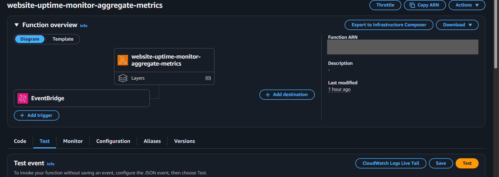
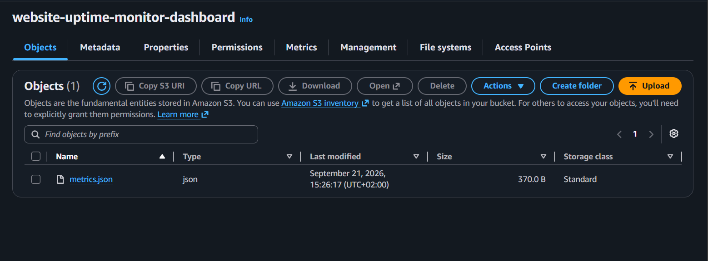

# Testing the metrics aggregation - Website Uptime Monitor

This test checks that the aggregate_metrics Lambda correctly calculates the statistics from the DynamoDB history and publishes them to the metrics.json file on the dashboard S3 bucket.

## Test: generating and publishing metrics.json

The website-uptime-monitor-aggregate-metrics Lambda normally triggers on its own through EventBridge, but it can also be invoked manually from the AWS console, in the Test tab:

After the invocation, the metrics.json file correctly appears in the website-uptime-monitor-dashboard bucket:

Opening the file directly from the bucket URL shows the calculated metrics: the site availability over the period (availability_percent at 99.57), the average response time (average_response_time_seconds at 0.096), the number of failures per check type with failures_by_check, and the total number of checks run per type with total_checks_by_check, the same for all three (1402) since the three check Lambdas run on the same interval.

## Finding

The failures counted here (6 availability, 7 latency, 13 content) include the ones triggered on purpose during the testing of the 3 Lambdas (see testing-3-lambdas.md), not just real incidents. The test shows that the DynamoDB, Lambda, S3 pipeline works correctly end to end, but it's still a visual check: no independent recalculation to confirm the numbers are correct. A possible improvement would be a test that recalculates the metrics directly from DynamoDB and compares them with metrics.json.
