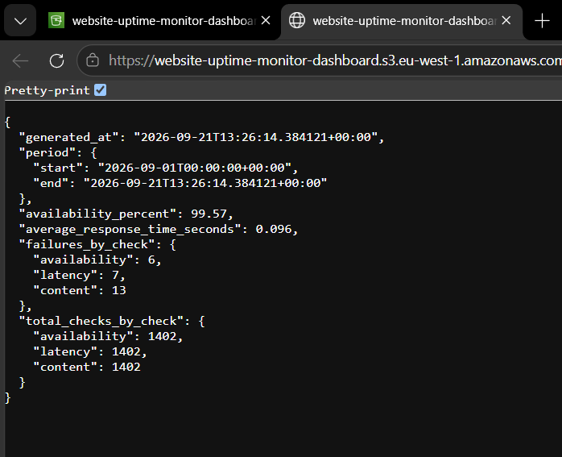

# Test de l'agrégation des métriques Website Uptime Monitor

Ce test vérifie que la Lambda aggregate_metrics calcule bien les statistiques à partir de l'historique DynamoDB et les publie dans le fichier metrics.json sur le bucket S3 du dashboard.

## Test: génération et publication de metrics.json

La Lambda website-uptime-monitor-aggregate-metrics se déclenche normalement toute seule via EventBridge, mais on peut aussi l'invoquer manuellement depuis la console AWS, dans l'onglet Test:

Après l'invocation, le fichier metrics.json apparaît bien dans le bucket website-uptime-monitor-dashboard:

En ouvrant le fichier directement depuis l'URL du bucket, on retrouve les métriques calculées: la disponibilité du site sur la période (availability_percent à 99.57), le temps de réponse moyen (average_response_time_seconds à 0.096), le nombre d'échecs par type de check avec failures_by_check, et le nombre total de checks exécutés par type avec total_checks_by_check, identique pour les trois (1402) puisque les trois Lambdas de check tournent sur le même intervalle.

## Constat

Les échecs comptés ici (6 availability, 7 latency, 13 content) comprennent ceux déclenchés volontairement pendant les tests des 3 Lambdas (voir testing-3-lambdas.md), pas que des vrais incidents. Le test montre que le pipeline DynamoDB, Lambda, S3 fonctionne bien de bout en bout, mais ça reste une vérification à l'oeil: pas de recalcul indépendant pour confirmer que les chiffres sont bons. Une amélioration possible serait un test qui recalcule les métriques directement depuis DynamoDB et compare avec metrics.json.
