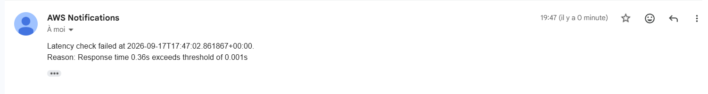
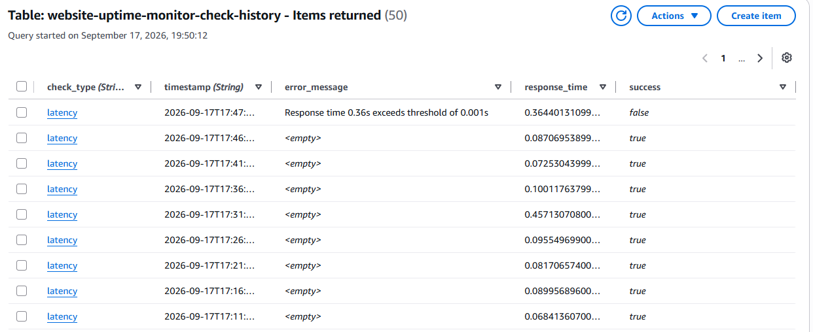
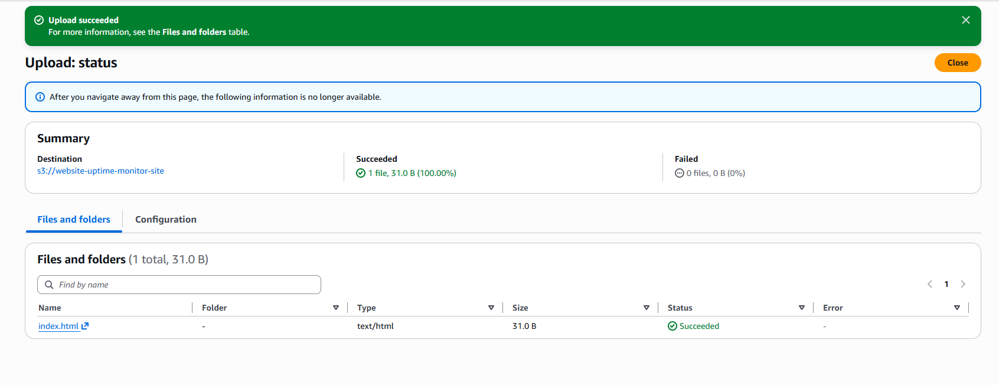
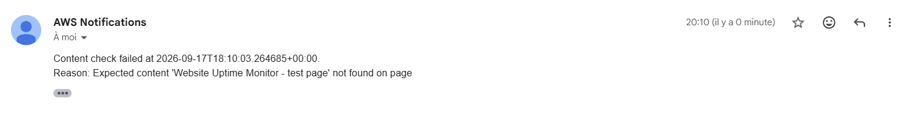

# Test des Lambdas — Website Uptime Monitor

Le but ici est de tester les trois Lambdas indépendamment (availability, latency, content), pour vérifier qu'elles fonctionnent bien avant de considérer le système comme opérationnel.

## Test 1 : check_availability

Le test est simple : on supprime le fichier `index.html` hébergé sur le bucket S3, pour vérifier qu'une notification d'erreur arrive bien sur le topic SNS (boîte mail).

En invoquant la Lambda manuellement, la notification arrive presque immédiatement.


À noter: supprimer le fichier html déclenche en réalité les 3 alertes (availability, latency et content), d'où les notifications multiples reçues. Le système ne fait pas la différence entre une vraie panne du site et un test isolé d'une seule Lambda, chaque check étant indépendant. Centraliser les alertes est une amélioration à prévoir pour la suite.

On vérifie ensuite dans DynamoDB que l'échec est bien enregistré (`success = false`) :


Pour remettre le site dans son état initial, un simple `terraform apply` suffit : Terraform recrée l'objet `index.html` avec le contenu défini dans la config. Ce fichier n'a pas de versioning S3 activé, donc pas de risque à le supprimer, contrairement à d'autres ressources plus critiques du projet.

## Test 2 : check_latency

Ce test vérifie que dépasser le seuil de latence déclenche bien une alerte.

En lançant :

```
terraform apply -var="latency_threshold_seconds=0.001"
```

on abaisse temporairement le seuil par défaut (30 secondes) à 0.001 seconde. En invoquant la Lambda `check_latency`, le temps de réponse réel dépasse forcément ce seuil et déclenche l'alerte :



On vérifie dans DynamoDB (requête en mode Query, tri décroissant pour voir les entrées les plus récentes en premier) :



Pour revenir à la config normale, un `terraform apply` sans l'option `-var` suffit : Terraform réapplique la valeur par défaut définie dans `variables.tf`.

## Test 3 : check_content

Ce test-là est différent: il porte sur le contenu affiché par le site, pas sur sa disponibilité ou sa vitesse. Le principe : on uploade un fichier `index.html` de remplacement, avec le même nom que l'original, ce qui écrase le fichier existant sur le bucket S3.



Le site affiche alors un contenu différent de celui attendu :


En invoquant la Lambda `check_content`, on reçoit une notification d'erreur confirmant que le contenu attendu n'est plus sur la page :



Vérification dans DynamoDB : l'échec est bien enregistré (`success = false`), avec le message d'erreur correspondant :


Pour restaurer le bon contenu, un `terraform apply` classique ne suffit pas ici. La ressource `aws_s3_object` ne détecte pas automatiquement les changements faits en dehors de Terraform : le state ne garde que le contenu défini dans la config, pas ce qui se trouve réellement sur le bucket. Il faut donc forcer la recréation de l'objet :

```
terraform apply -replace="module.monitored_site.aws_s3_object.index"
```

Cette commande force Terraform à réuploader le contenu défini dans la configuration, indépendamment de ce qui se trouve réellement sur le bucket.

## Constat : absence de déduplication des alertes

Les trois tests confirment que le système fonctionne comme prévu, mais ils mettent aussi en évidence une limite : chaque Lambda déclenche sa propre alerte, indépendamment des autres. Si le site tombe complètement, on reçoit jusqu'à 3 notifications distinctes pour ce qui est en réalité un seul incident.

C'est une amélioration prioritaire pour la suite du projet, avant d'ajouter d'autres types de checks.
